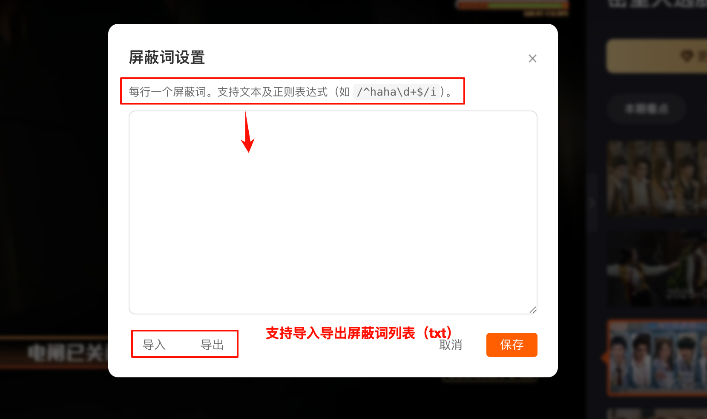

# auto-close-danmu

芒果TV网页版弹幕增强

芒果web端每次新开一个视频弹幕都会自动开启，在看剧时，如果不想开弹幕，这时候就得每次都手动关，很麻烦

所以写了这个脚本，可以默认关闭弹幕

## 功能介绍

### 基础功能
1. **自动关闭弹幕**：首次打开视频、页面内切换不同集数、页面重载时都生效
2. **一键开关**：屏幕右下角按钮，可选择是否自动关闭弹幕，默认自动关闭弹幕
3. **快捷键 D**：手动开启/关闭弹幕
4. **快捷键 F**：开启/退出全屏

### 高级屏蔽词功能 🆕
5. **不限数量**：突破网页端10个屏蔽词的限制，想加多少加多少
6. **正则支持**：支持正则表达式匹配，例如 `/^广告.*$/i` 可以屏蔽所有以"广告"开头的弹幕
7. **导入导出**：支持导出为 txt 文件，方便备份和跨设备使用
8. **本地存储**：所有设置保存在浏览器本地，刷新页面不会丢失

## 安装方式

1. 前提：已安装油猴或类似支持安装脚本的插件
2. 方法一 → [点击链接安装](https://raw.githubusercontent.com/mankaki/auto-close-danmu/main/auto-close-danmu.user.js)
3. 方法二 → [前往 Greasy Fork 安装](https://greasyfork.org/zh-CN/scripts/515421-%E8%8A%92%E6%9E%9Ctv%E7%BD%91%E9%A1%B5%E7%89%88%E8%87%AA%E5%8A%A8%E5%85%B3%E9%97%AD%E5%BC%B9%E5%B9%95)

## 使用截图

