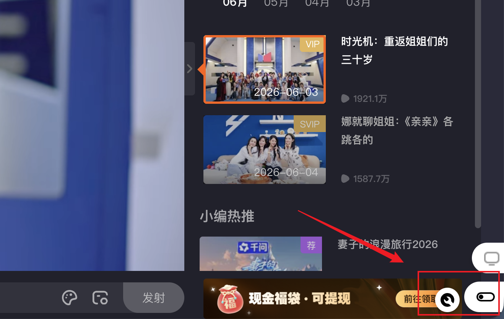
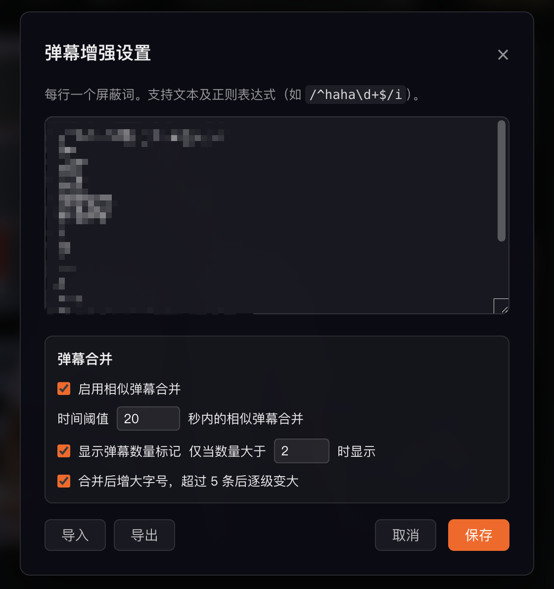
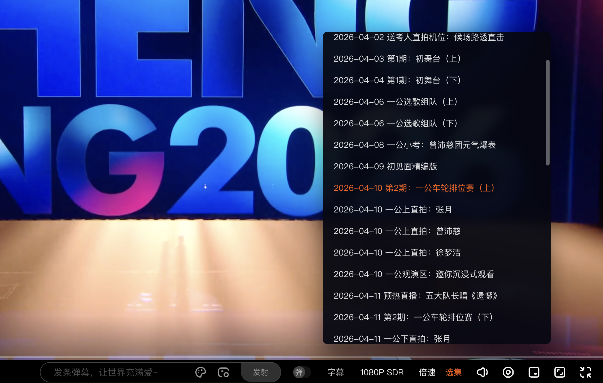

# auto-close-danmu

芒果TV网页版弹幕增强

芒果TV 网页端弹幕增强脚本，支持自动关闭弹幕、快捷键操作（D 键切换弹幕 / F 键全屏）、相似弹幕合并与数量标记、高级屏蔽词设置（不限数量、支持正则表达式、导入导出、本地持久化存储）、视频列表名称自动换行、自动切换“往期正片”以及跨月自动连播。

## 功能介绍

### 基础功能
1. **自动关闭弹幕**：首次打开视频、页面内切换不同集数、页面重载时都生效
2. **一键开关**：屏幕右下角按钮，可选择是否自动关闭弹幕，默认自动关闭弹幕
3. **快捷键 D**：手动开启/关闭弹幕
4. **快捷键 F**：开启/退出全屏
5. **相似弹幕合并**：默认合并 20 秒内的相似弹幕，显示合并数量，超过 5 条后自动增大字号

### 高级屏蔽词功能
6. **不限数量**：突破网页端10个屏蔽词的限制，想加多少加多少
7. **正则支持**：支持正则表达式匹配，例如 `/^广告.*$/i` 可以屏蔽所有以"广告"开头的弹幕
8. **导入导出**：支持导出为 txt 文件，方便备份和跨设备使用
9. **本地存储**：屏蔽词优先保存在油猴/Tampermonkey 脚本存储中，减少清理网页 Cookie 或站点数据时误删的风险；刷新页面不会丢失

### 播放列表增强
10. **视频列表名称自动换行**：右侧选集列表的标题不再被截断，完整显示
11. **自动切换往期正片**：从"本期看点"进入视频页时，自动切换到"往期正片"Tab（"精彩花絮"不干预）
12. **跨月自动连播**：当前月份最后一集播完后，自动切换到下一个月的第一集继续播放，不再跳转到其他节目
13. **全屏选集**：网页内全屏或浏览器全屏播放时，可在控制栏打开选集列表，并保持全屏切换到对应集数

## 安装方式

1. 前提：已安装油猴或类似支持安装脚本的插件
2. 方法一 → [点击链接安装](https://raw.githubusercontent.com/mankaki/auto-close-danmu/main/auto-close-danmu.user.js)
3. 方法二 → [前往 Greasy Fork 安装](https://greasyfork.org/zh-CN/scripts/515421-%E8%8A%92%E6%9E%9Ctv%E7%BD%91%E9%A1%B5%E7%89%88%E8%87%AA%E5%8A%A8%E5%85%B3%E9%97%AD%E5%BC%B9%E5%B9%95)

## 使用截图

